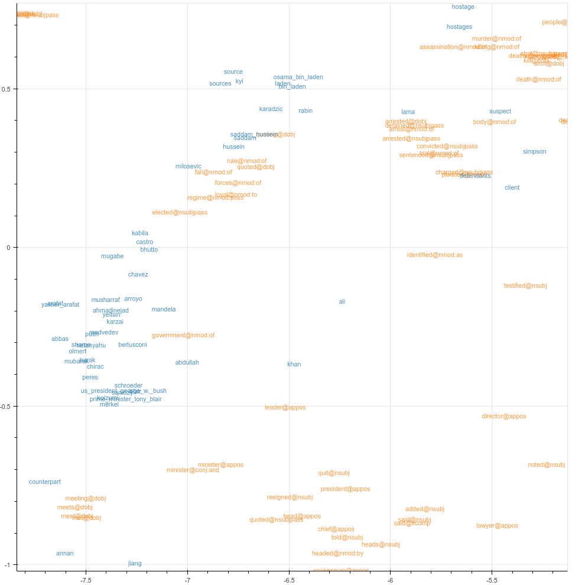

# selpref-emb
Selectional Preference Embeddings ([EMNLP 2017](http://aclweb.org/anthology/D17-1138))

This repository contains joint embeddings of selectional preferences, words, and fine-grained entity types.

# Download

* [lemmatized, basicDependencies](https://drive.google.com/file/d/0B5Gn0zIax9GPZGRMZUVFYUZkR2s/view?usp=sharing&resourcekey=0-7flrhN7TF2TaF2DHjYRDWA)
* [lemmatized, enhancedDependencies](https://drive.google.com/file/d/0B5Gn0zIax9GPTkF0dmswNEttQXM/view?usp=sharing&resourcekey=0-zKCxfoocmT5U12fl0BFkSw)
* [lemmatized, enhancedPlusPlusDependencies](https://drive.google.com/file/d/0B5Gn0zIax9GPc2xoNWxSaUZpVkU/view?usp=sharing&resourcekey=0-Weo0VZg0tWnjmR2O0zPUDA)

* [unlemmatized, basicDependencies](https://drive.google.com/file/d/0B5Gn0zIax9GPVEFEbXRTaHR1b28/view?usp=sharing&resourcekey=0-zL-K_V61ueNTidqNINj92w)

# Usage

The files are in [gensim](https://github.com/RaRe-Technologies/gensim) model format, which can be loaded in Python like this:

```python
from gensim.models import KeyedVectors

emb_file = "/path/to/embedding_file"
emb = KeyedVectors.load_word2vec_format(emb_file, binary=True)
```

The vocabulary consists of:

- verbs and their dependency relation separated by "@", e.g. "sink@nsubj" or "elect@dobj"
- words and short noun phrases, e.g. "Titanic"
- fine-grained entity types using the [FIGER](http://aiweb.cs.washington.edu/ai/pubs/ling-aaai12.pdf) inventory, e.g.: /product/ship or /person/politician



# Reference

```bibtex
@InProceedings{D17-1138,
  author = 	"Heinzerling, Benjamin
		and Moosavi, Nafise Sadat
		and Strube, Michael",
  title = 	"Revisiting Selectional Preferences for Coreference Resolution",
  booktitle = 	"Proceedings of the 2017 Conference on Empirical Methods in Natural Language Processing",
  year = 	"2017",
  publisher = 	"Association for Computational Linguistics",
  pages = 	"1343--1350",
  location = 	"Copenhagen, Denmark",
  url = 	"http://aclweb.org/anthology/D17-1138"
}
```
